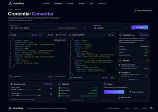
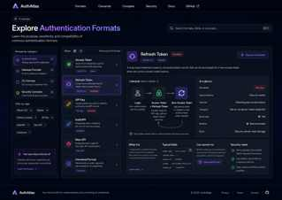
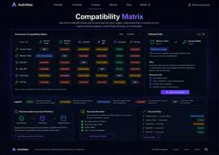

# AuthAtlas

AuthAtlas is a local-first AI credential inspector and format converter for OAuth tokens, API keys, Sub2API, New API, and related gateway credential formats.

It helps developers inspect credential structure, understand security and lifecycle semantics, compare compatibility, normalize credential material, and distinguish local schema mapping from operations that require a credential issuer.

## Why AuthAtlas

Credential configuration is often treated as generic JSON even though access tokens, refresh tokens, API keys, and gateway wrappers have very different security and conversion rules. AuthAtlas makes those differences explicit.

- **Local-first inspection** — supported parsing, masking, normalization, comparison, and schema mapping happen in browser memory.
- **Credential-aware documentation** — Access Token, Refresh Token, API Key, Sub2API, New API, and Canonical Format are documented as distinct entities.
- **Explicit conversion semantics** — conversion paths are classified as Self, Extract, Schema Map, OAuth Exchange, or Impossible.
- **Gateway-focused tooling** — Sub2API and New API are treated as version-dependent gateway credential wrappers, not generic OAuth synonyms.
- **Static and deployable** — Astro generates crawlable HTML while React powers the interactive credential workbench.

## Supported credential formats

| Format | Primary role | Typical conversion behavior |
| --- | --- | --- |
| Access Token | Authorize protected API requests | Extract or schema-map existing token material |
| Refresh Token | Obtain new access tokens | Local normalization; access-token issuance requires OAuth exchange |
| API Key | Direct API authentication | Normalize or map into compatible gateway wrappers |
| Sub2API | Gateway account/configuration wrapper | Extract or schema-map when source and target fields are compatible |
| New API | Gateway provider/channel configuration | Extract or schema-map with version-aware field validation |
| Canonical Format | AuthAtlas intermediate representation | Normalize existing credential material without inventing secrets |

## Conversion model

AuthAtlas uses five path labels so the UI and documentation do not overstate what a converter can do:

```text
Self            Source and target are already the same format
Extract         Required credential material already exists in the source
Schema Map      Compatible material is represented in another wrapper/schema
OAuth Exchange  A provider authorization server must issue a new credential
Impossible      Required secret material cannot safely be derived from the source
```

A refresh token, for example, cannot be transformed locally into a new access token. The refresh token must be exchanged with the provider authorization server.

## Documentation map

```text
/
├── /converter
├── /formats
│   ├── /formats/access-token
│   ├── /formats/refresh-token
│   ├── /formats/api-key
│   ├── /formats/sub2api
│   ├── /formats/new-api
│   └── /formats/canonical
├── /compare
│   └── dedicated comparison and conversion guides
├── /guides
│   └── Sub2API and New API developer guides
└── /security
```

The site currently generates static format pages, conversion/comparison pages, topic guides, a sitemap, robots directives, canonical metadata, and structured data in addition to the interactive tools.

## Architecture

AuthAtlas uses Astro for static generation and React for the interactive credential workbench.

```text
Astro static site
├── primary landing pages
├── credential format documentation
├── comparison and conversion pages
├── developer guides
├── sitemap / robots / metadata
└── structured data

React client island
├── credential inspector
├── converter
├── formats workspace
└── compatibility matrix
```

Primary routes expose meaningful static HTML before client-side interaction is required. Deep documentation routes are statically generated by Astro.

## UI reference

The frontend is implemented against high-fidelity reference screens stored directly in the repository.

### Home


### Converter



### Formats



### Compatibility Matrix



## Security model

AuthAtlas is designed as a static, local-first application. Supported credential parsing, masking, comparison, normalization, compatible schema mapping, and export run in browser memory. The current implementation does not require a backend conversion endpoint.

OAuth exchange is treated separately because it requires a provider network request and credential issuance. AuthAtlas does not claim to fabricate credential material that is absent from the source.

Do not paste credentials into untrusted deployments. Gateway schemas and adapter mappings should be verified against the exact version of the target project before import.

## Development

```bash
npm install
npm run dev
```

Production build:

```bash
npm run build
```

The generated `dist/` directory can be deployed directly to Cloudflare Pages.

### SEO environment

Copy `.env.example` for production configuration and set the public origin:

```bash
PUBLIC_SITE_URL=https://your-domain.example
```

`PUBLIC_SITE_URL` is used to generate self-referencing canonical URLs, `og:url`, absolute social preview URLs, sitemap entries, and absolute structured-data URLs. Local and CI builds intentionally do not invent a production origin.

### Cloudflare Pages settings

- Build command: `npm run build`
- Build output directory: `dist`
- Output mode: static Astro site
- Environment variable: `PUBLIC_SITE_URL=https://<production-domain>`

No Cloudflare SSR adapter is required for the current architecture because credential handling remains browser-side.

## Project documentation

- [`docs/SEO_GEO_ROADMAP.md`](docs/SEO_GEO_ROADMAP.md) — full SEO + GEO implementation roadmap
- [`docs/SEO_GEO_PROGRESS.md`](docs/SEO_GEO_PROGRESS.md) — current implementation and deployment status
- [`docs/ENTITY_POSITIONING.md`](docs/ENTITY_POSITIONING.md) — canonical AuthAtlas entity, terminology, GitHub description, and recommended topics
- [`docs/UI_DESIGN_SPEC.md`](docs/UI_DESIGN_SPEC.md) — frontend implementation specification

## Recommended repository topics

```text
oauth oauth2 authentication api-key access-token refresh-token credentials
developer-tools ai-tools api-gateway sub2api new-api astro react typescript
```

## Product roadmap

- Versioned schema adapters
- JWT payload inspector
- Import/export validation
- Offline/PWA mode
- Visual regression snapshots against reference screens
- Search-data-driven guide expansion

## Repository

https://github.com/1264585648/gpt-converter
